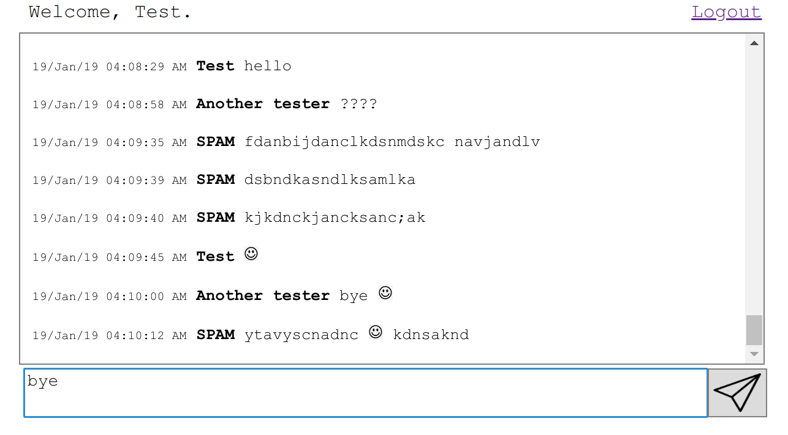

# The Chat Room
Add PostgreSQL JDBC driver to *$TOMCAT_HOME/lib*. <br />
Add database to PSQL.
```
psql < src/database.sql
```
Set PSQL username and password in src/Chat.java. <br />
Compile classes:
```
javac -cp lib/javax.servlet.jar -d WEB-INF/classes   src/Chat.java 
javac -cp lib/javax.servlet.jar -d WEB-INF/classes src/ChatMsg.java
javac -cp lib/javax.servlet.jar -d WEB-INF/classes src/SignIn.java
javac -cp lib/javax.servlet.jar -d WEB-INF/classes src/ReloadChat.java
```
Copy img, WEB-INF, index.jsp, room.jsp, logout.jsp, functions.js, styles.css to $TOMCAT_HOME/webapps.
```
mkdir $TOMCAT_HOME/webapps/chatroom
cp -r -t $TOMCAT_HOME/webapps/chatroom img WEB-INF
cp -t $TOMCAT_HOME/webapps/chatroom src/index.jsp src/room.jsp src/logout.jsp src/functions.js src/styles.css
```
## Run
 *Launch TomCat*
```
./$TOMCAT_HOME/bin/startup.sh
```
Go to:
```
http://localhost:8080/chatroom
```
## Reset 
```
psql < sql/database.sql
$TOMCAT_HOME/bin/shutdown.sh
$TOMCAT_HOME/bin/startup.sh
```


## Author
* **Magdalena Proszewska** - https://github.com/mproszewska
